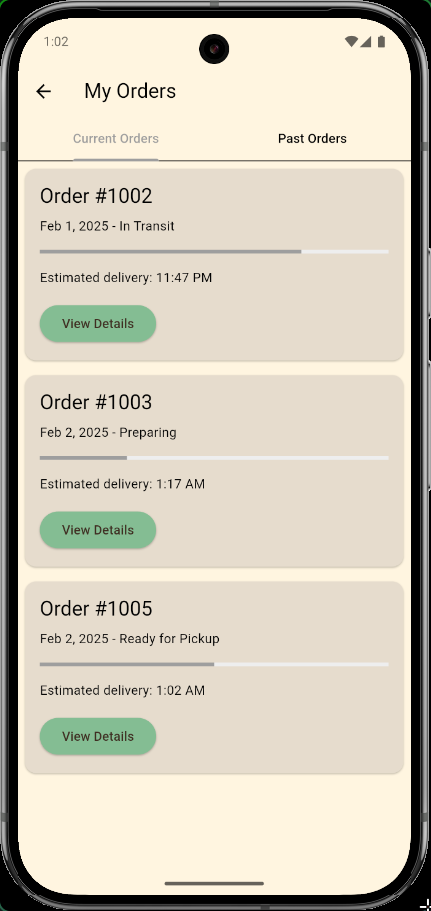
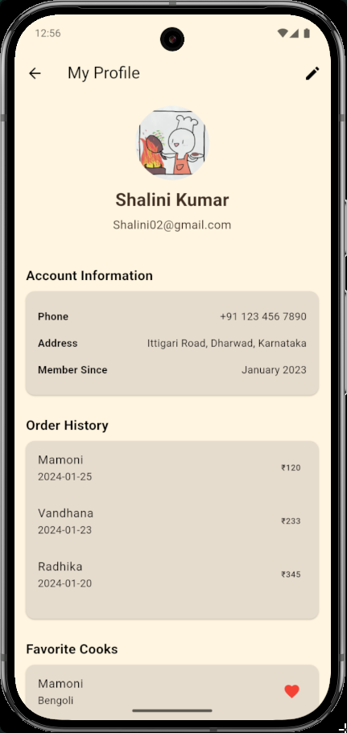
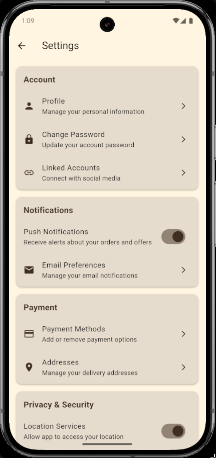

# 🚀 Campus Dabba – The Future of Home-Cooked Food Delivery  
**Bridging Home Cooks and Students with a Dynamic AI-Powered Platform**  

## 🍲 What is Campus Dabba?  
Campus Dabba is a **Next.js-powered** platform that connects students and professionals with **authentic, homemade meals** prepared by **local households**. Our focus is on:  
✔️ **Supporting local families** by giving them a platform to share their culinary skills  
✔️ **Limiting the number of customers per household** to ensure personalized, high-quality meals  
✔️ **Providing healthy, home-cooked alternatives** to commercial food options  

With a **dynamic AI-driven system**, it seamlessly updates orders, schedules, payments, and cook availability in real time.  

---

## 🔥 Key Features  
### 🏡 **For Customers**  
- **Find nearby home cooks** dynamically  
- **Explore verified cook profiles** (ratings, specialties, certifications, and past orders)  
- **Order meals with real-time availability** (ensuring freshness & limited batch serving)  
- **Track orders dynamically**  
- **AI-powered chatbot** fetches order status, estimated delivery time, and cook availability  
- **Seamless payments & wallet integration**  

## Screenshots

### Home Screen


### Order Tracking Screen


### User Profile


### Settings


## Installation

1. **Clone the repository:**  
   ```bash
   git clone https://github.com/Campus-Dabba/campus_dabba_mobile.git
   ```

2. **Navigate to the project directory:**  
   ```bash
   cd campus_dabba_mobile
   ```

3. **Get Flutter dependencies:**  
   ```bash
   flutter pub get
   ```

4. **Run the app:**  
   ```bash
   flutter run
   ```

## Requirements

- Flutter SDK
- Dart SDK
- Android Studio or Xcode
- Android/iOS emulators or devices with ADB


---

Developed with ❤️ using Flutter.