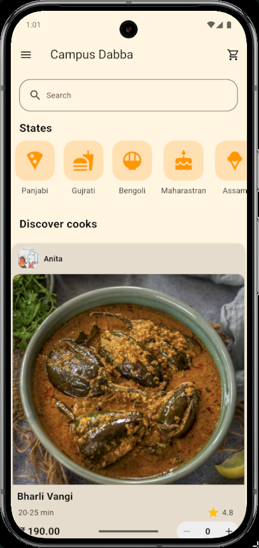

# Campus Dabba

Campus Dabba is a Flutter-based food ordering app designed specifically for campus environments. It allows students, faculty, and staff to browse menus, place orders, and track deliveries seamlessly.

## Features

- **User-Friendly Interface:** Simple and intuitive design for quick navigation.
- **Real-Time Order Tracking:** Know exactly when your food will arrive.
- **Customizable Menus:** Explore diverse food options available on campus.
- **Secure Payments:** Multiple payment options with secure transactions.
- **Order History:** Keep track of your past orders for easy reordering.

## Screenshots

### Home Screen


### Menu Screen


### Order Tracking Screen


*Replace the image paths (`screenshots/home_screen.png`, etc.) with actual paths to your screenshots.*

## Installation

1. **Clone the repository:**  
   ```bash
   git clone https://github.com/yourusername/campus-dabba.git
   ```

2. **Navigate to the project directory:**  
   ```bash
   cd campus-dabba
   ```

3. **Get Flutter dependencies:**  
   ```bash
   flutter pub get
   ```

4. **Run the app:**  
   ```bash
   flutter run
   ```

## Requirements

- Flutter SDK
- Dart SDK
- Android Studio or Xcode for emulators

## Contributing

Contributions are welcome! Please fork the repository and submit a pull request.

## License

This project is licensed under the [MIT License](LICENSE).

---

Developed with ❤️ using Flutter.

